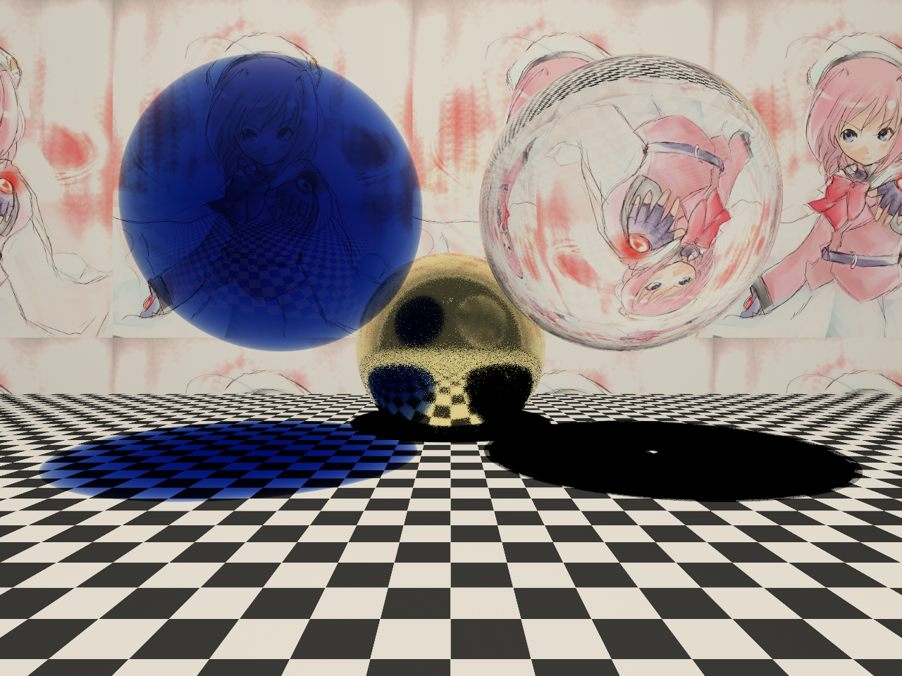

This is a raytracer I wrote once since I didn't think I knew enough math.
I never actually got a chance to use any 3D matrices, so I still don't know them,
but I think there were some neat parts in here.

I don't like raytracing anymore, though; it's good for refraction but good
antialiasing and textures are too hard. If I work on this again I'll ditch
it completely and do forward raytracing for global illumination, then
some kind of ordinary rendering with edge AA+good textures (or try
to combine them in some way so it can still have camera effects).

=======================================
Building
=======================================

Requires libpng and pkg-config (e.g. from MacPorts). Does not work with
-ffast-math (breaks infinity sentinel used for max-distance tracking).

  make          # optimized build
  make debug    # FP exception traps enabled, no -ffast-math

Outputs scene.bmp (autoleveled 8-bit) and scene.hdr (Radiance HDR, raw
floating point via RGBE encoding — use any HDR viewer for the true output).

=======================================
Neat parts
=======================================

* Better-than-bilinear texture interpolation
* Attempts to be more correct than usual for image import/export -
  images are properly converted between sRGB and linear FP RGB using noise shaping.
* Simulates unpolarized Fresnel equations
* A backtracking hack for caustics without doing global illumination
* SIMD-accelerated vector class (SSE on x86 via -march=native)
* A somewhat-successful nonlinear texture interpolation algorithm

=======================================
Not-neat parts
=======================================

* It's unreadable. Although I'd like to think it's better than the tutorials
  I read first.
* No collision acceleration. It is pretty fast considering this+backtracking, though.
* The texture interpolation has a fixed-sized support, so it'll look bad if
  textures are effectively downsized (needs ray differentials)
* Needs anisotropy
* You can only do spheres and planes.
* No scene file format.

======================================
Short-term todo
======================================

* Adopt Cook-Torrance instead of Phong+Fresnel, or read
  http://renderwonk.com/publications/s2010-shading-course
